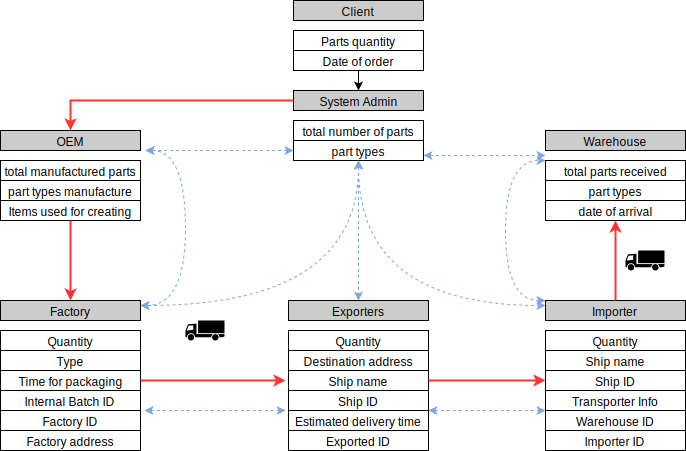

# Blockchain supply chain 

# Aim
One of the major use of blockchain is to make efficient supply chains; hence this project is only for learning purpose to understand the in-depths of blockchain and build a simple Etherium based blockchain for car manufacturing supply chain. 

Just like any other supply chain, the user story is similar and based on a client which initiates by placing an order of car parts, .

# Workflow

